# IntakeGateway: Project Orientation Document

**Document Version:** 1.0
**Date:** February 4, 2026
**Project Codename:** IntakeGateway

---

## Phase 1 — Project Orientation

### Product Purpose

**IntakeGateway** is an enterprise-grade data integration platform that automates the extraction of data from REST APIs and imports it into Oracle databases. It eliminates manual data entry by providing:

- **Automated API Data Fetching** - Connect to any REST API with configurable authentication
- **Intelligent Field Mapping** - Map JSON response fields to Oracle table columns with transformation suggestions
- **Scheduled Execution** - Cron-based scheduling for recurring imports
- **Audit Trail** - Complete logging of all import operations with row-level error tracking
- **Upsert Support** - Insert or update records with skip logic for processed rows

### Users and Roles

| Role | Responsibilities | Access Level |
|------|------------------|--------------|
| **Data Engineer** | Configure tasks, mappings, and schedules | Full CRUD access |
| **System Admin** | Manage database connections, monitor runs | Configuration + monitoring |
| **Business Analyst** | View dashboards, verify data imports | Read-only access |

*Note: Current implementation has no built-in authentication/authorization. All users have full access.*

### Critical Business Flows

#### Task Creation Flow

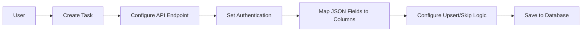

#### Task Execution Flow

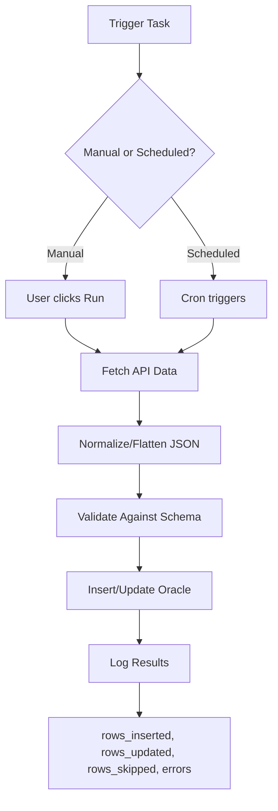

#### Schedule Management Flow

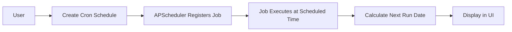

### High-Level System Diagram

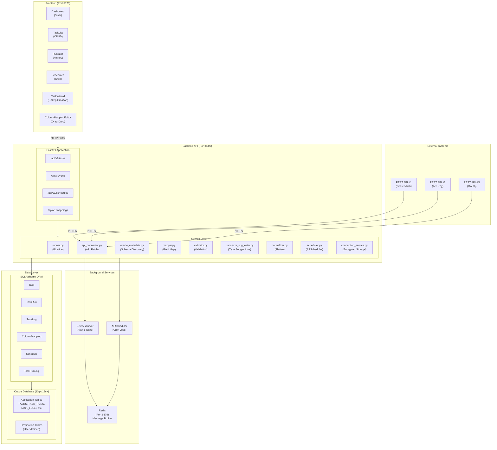

### Core Flows Summary

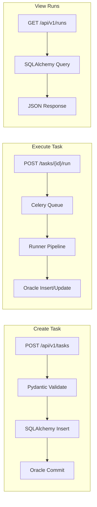

| Flow | Entry Point | Critical Path | Side Effects |
|------|-------------|---------------|--------------|
| Create Task | POST /api/v1/tasks | Route → Pydantic → SQLAlchemy → Oracle | None |
| Execute Task | POST /api/v1/tasks/{id}/run | Route → Celery → Runner Pipeline → Oracle | External API call, DB writes, Logging |
| View Runs | GET /api/v1/runs | Route → SQLAlchemy → Response | None |
| Create Schedule | POST /api/v1/schedules/{task_id} | Route → APScheduler Registration → Oracle | Cron job registered |
| Map Columns | POST /api/v1/tasks/{id}/mappings | Route → OracleMetadata → SQLAlchemy | None |

---

## Phase 2 — Run It Locally

### SETUP_NOTES.md

#### Prerequisites

| Requirement | Version | Purpose |
|-------------|---------|---------|
| Python | 3.11+ | Backend runtime |
| Node.js | 18+ | Frontend runtime |
| Docker | 24+ | Container orchestration |
| Docker Compose | 2.20+ | Multi-container setup |
| Oracle Database | 11g+ / 19c+ | Target database |

#### Environment Setup

1. **Clone Repository**
```bash
git clone https://github.com/Badry-Kudu/API2DB-Importer.git
cd IntakeGateway
```

2. **Copy Environment File**
```bash
cp .env.example .env
```

3. **Configure Environment Variables**
```bash
# Edit .env with your Oracle connection details
# Required variables:
ORACLE_USER=your_oracle_user
ORACLE_PASSWORD=your_oracle_password
ORACLE_HOST=your_oracle_host
ORACLE_PORT=1521
ORACLE_SERVICE_NAME=ORCLPDB1

# Required for encryption (change in production!)
SECRET_KEY=your-secret-key-change-me-in-production

# Optional
APP_TIMEZONE=Asia/Riyadh
APP_LOG_LEVEL=INFO
```

#### Starting Each Layer

**Option A: Docker Compose (Recommended)**
```bash
# Start all services
docker-compose up -d

# Services started:
# - api (FastAPI): http://localhost:8000
# - worker (Celery): background processing
# - scheduler (APScheduler): cron jobs
# - redis: message broker on port 6379
```

**Option B: Manual Start (Development)**

1. **Start Redis**
```bash
docker run -d --name redis -p 6379:6379 redis:7-alpine
```

2. **Start Backend**
```bash
cd backend
python -m venv venv
source venv/bin/activate  # Windows: venv\Scripts\activate
pip install -r requirements.txt
uvicorn app.main:app --reload --port 8000
```

3. **Start Celery Worker (separate terminal)**
```bash
cd backend
source venv/bin/activate
celery -A app.celery_app worker --loglevel=info
```

4. **Start Frontend**
```bash
cd frontend
npm install
npm run dev
# Frontend available at http://localhost:5173
```

#### Verification Checklist

| Check | How to Verify | Expected Result |
|-------|---------------|-----------------|
| Frontend loads | Visit http://localhost:5173 | Dashboard displays |
| Backend responds | Visit http://localhost:8000/docs | Swagger UI loads |
| Database connected | Check backend logs | "Connected to Oracle" |
| Redis connected | Check Celery worker logs | "Connected to redis://..." |

#### Complete User Flow Test

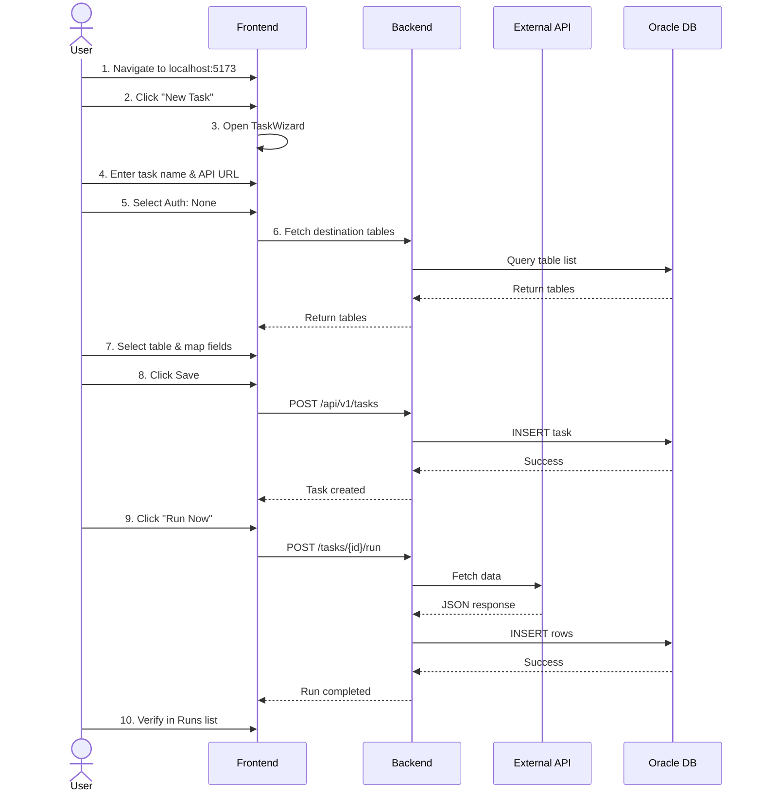

---

## Phase 3 — Architecture & Boundaries

### Where Does Business Logic Live?

| Logic Type | Location | Files |
|------------|----------|-------|
| **API Data Fetching** | Service Layer | `backend/app/services/api_connector.py` |
| **Data Transformation** | Service Layer | `backend/app/services/normalizer.py`, `mapper.py` |
| **Validation** | Service Layer | `backend/app/services/validator.py` |
| **Database Operations** | Service Layer | `backend/app/services/runner.py:320-568` |
| **Scheduling** | Service Layer | `backend/app/services/scheduler.py` |
| **Task Orchestration** | Service Layer | `backend/app/services/runner.py:run_import()` |

### Where Is Validation Done?

| Validation Type | Location | Implementation |
|-----------------|----------|----------------|
| **Request Validation** | API Layer | Pydantic models in `backend/app/db/schemas/` |
| **Auth Validation** | Schema Layer | `backend/app/db/schemas/task.py:validate_auth_config()` |
| **Data Type Validation** | Service Layer | `backend/app/services/validator.py:validate_row()` |
| **Oracle Schema Validation** | Service Layer | `backend/app/services/oracle_metadata.py` |

### How Does Frontend Talk to Backend?

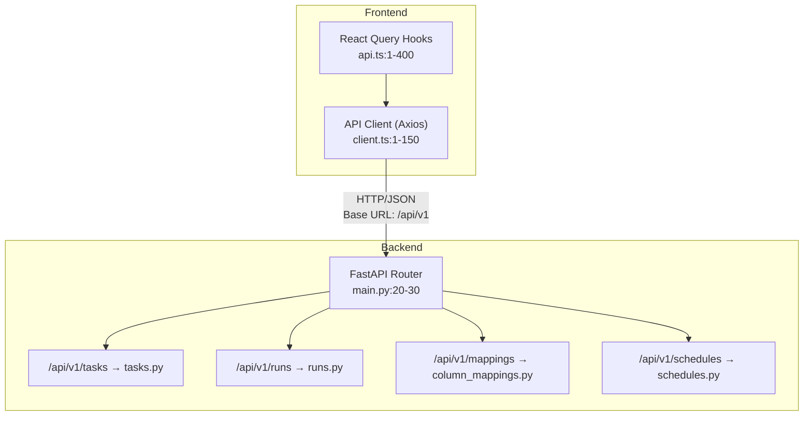

### Where Are Side Effects?

| Side Effect | Location | Trigger |
|-------------|----------|---------|
| **External API Calls** | `api_connector.py:fetch()` | Task execution |
| **Database Writes** | `runner.py:_insert_single_row()`, `_update_existing_row()` | Task execution |
| **Logging to DB** | `runner.py:log_step()`, `log_row_error()` | Throughout execution |
| **File Writes** | `connection_service.py:_write_connections()` | Connection management |
| **Cron Registration** | `scheduler.py:add_job()` | Schedule creation |

### Annotated Architecture with File Paths

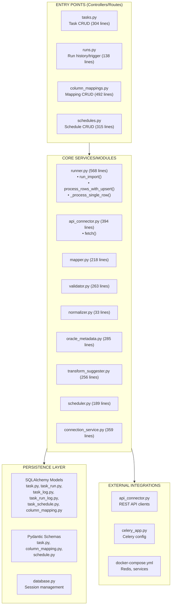

---

## Phase 4 — Data & State Audit

### Database Schema

```mermaid
erDiagram
    TASKS {
        NUMBER id PK
        VARCHAR2 name UK
        VARCHAR2 endpoint_path
        VARCHAR2 http_method
        VARCHAR2 auth_type
        CLOB auth_config
        VARCHAR2 dest_table
        NUMBER batch_size
        NUMBER is_active
        NUMBER upsert_enabled
        CLOB upsert_keys
        VARCHAR2 skip_column
        VARCHAR2 skip_value
        NUMBER continue_on_error
        TIMESTAMP created_at
        TIMESTAMP updated_at
    }

    TASK_RUNS {
        NUMBER id PK
        NUMBER task_id FK
        VARCHAR2 status
        TIMESTAMP started_at
        TIMESTAMP completed_at
        NUMBER rows_fetched
        NUMBER rows_inserted
        NUMBER rows_updated
        NUMBER rows_skipped
        NUMBER rows_failed
        CLOB error_message
    }

    TASK_LOGS {
        NUMBER id PK
        NUMBER task_run_id FK
        VARCHAR2 step_name
        VARCHAR2 message
        CLOB details
        TIMESTAMP created_at
    }

    TASK_RUN_LOGS {
        NUMBER id PK
        NUMBER task_run_id FK
        NUMBER row_number
        VARCHAR2 error_message
        VARCHAR2 column_name
        TIMESTAMP created_at
    }

    TASK_SCHEDULES {
        NUMBER id PK
        NUMBER task_id FK UK
        VARCHAR2 cron_expression
        NUMBER is_enabled
        TIMESTAMP last_run_date
        TIMESTAMP next_run_date
        TIMESTAMP created_at
    }

    COLUMN_MAPPINGS {
        NUMBER id PK
        NUMBER task_id FK
        VARCHAR2 source_field
        VARCHAR2 dest_column
        CLOB transform_rules
        NUMBER is_key_field
        TIMESTAMP created_at
    }

    TASKS ||--o{ TASK_RUNS : "has many"
    TASKS ||--o| TASK_SCHEDULES : "has one"
    TASKS ||--o{ COLUMN_MAPPINGS : "has many"
    TASK_RUNS ||--o{ TASK_LOGS : "has many"
    TASK_RUNS ||--o{ TASK_RUN_LOGS : "has many"
```

### Critical Tables and Invariants

| Table | Criticality | Invariants | Corruption Risk |
|-------|-------------|------------|-----------------|
| **tasks** | HIGH | name UNIQUE, auth_config encrypted | Task duplication, auth exposure |
| **task_runs** | MEDIUM | status must be valid enum | Orphaned runs, wrong status |
| **column_mappings** | HIGH | task_id FK valid | Invalid mappings break execution |
| **task_schedules** | MEDIUM | task_id UNIQUE | Duplicate schedules |

### Source of Truth vs Derived Data

| Data Type | Source | Derived From | Cache Location |
|-----------|--------|--------------|----------------|
| Task Configuration | `tasks` table | - | - |
| Run History | `task_runs` table | - | - |
| Task Statistics | Aggregated | `task_runs` | Computed on-demand |
| Oracle Table Schema | Oracle DB | - | Not cached |
| Next Run Date | Calculated | cron_expression | `task_schedules.next_run_date` |

### Write Operation Trace: Task Execution

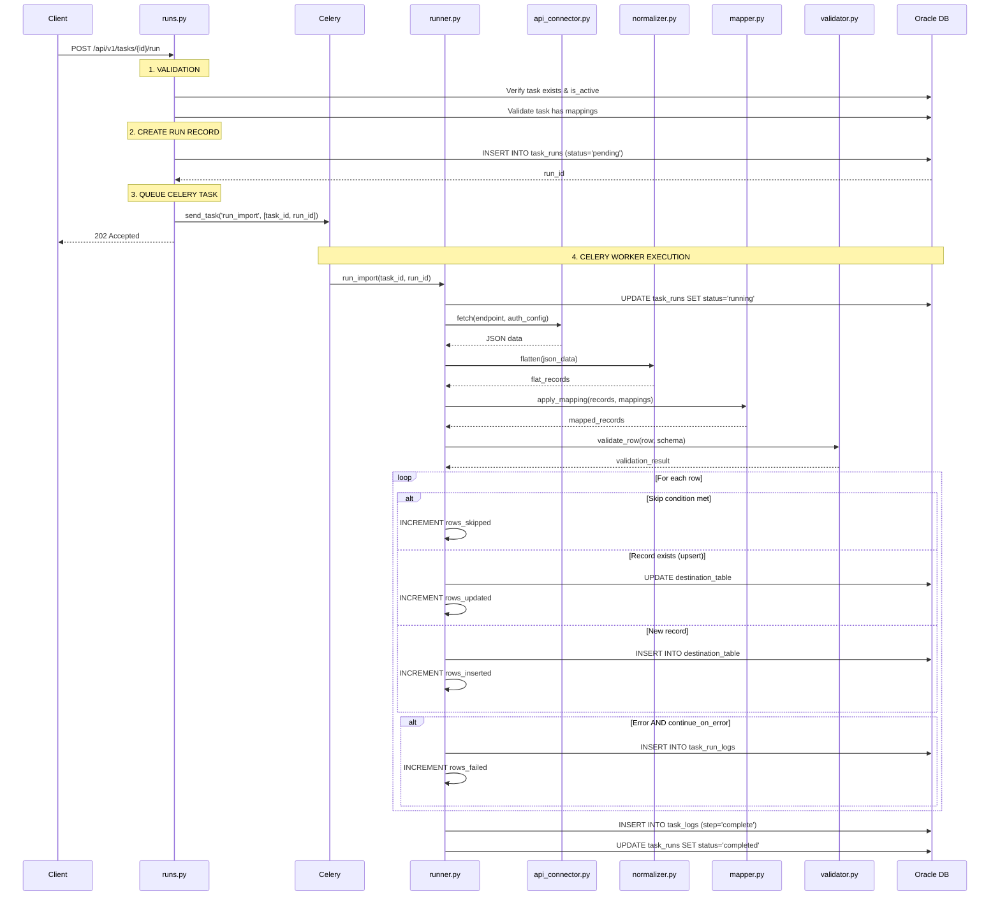

---

## Phase 5 — Code Reading Strategy

### Recommended Reading Order

#### 1. API Routes / Controllers
```
backend/app/api/v1/routes/tasks.py        # Start here - understand CRUD
backend/app/api/v1/routes/runs.py         # How execution is triggered
backend/app/api/v1/routes/column_mappings.py  # Field mapping management
backend/app/api/v1/routes/schedules.py    # Cron scheduling
```

#### 2. Services / Use-Cases
```
backend/app/services/runner.py            # CRITICAL - main pipeline
backend/app/services/api_connector.py     # External API communication
backend/app/services/validator.py         # Data validation
backend/app/services/mapper.py            # Field transformation
```

#### 3. Models / Schemas
```
backend/app/db/models/task.py             # Core entity
backend/app/db/schemas/task.py            # Request/response validation
```

#### 4. Frontend API Clients
```
frontend/src/api/client.ts                # HTTP client
frontend/src/hooks/api.ts                 # React Query hooks
```

#### 5. Frontend State Management
```
frontend/src/hooks/api.ts                 # React Query (server state)
frontend/src/pages/*.tsx                  # Local component state
```

### "If X Breaks, Where Do I Look?"

| Symptom | Primary Location | Secondary Location |
|---------|------------------|-------------------|
| Task creation fails | `routes/tasks.py:create_task()` | `schemas/task.py:TaskCreate` |
| API fetch returns empty | `services/api_connector.py:fetch()` | Task auth_config |
| Mapping fails | `services/mapper.py:apply_mapping()` | `column_mappings` table |
| Validation errors | `services/validator.py:validate_row()` | `oracle_metadata.py` |
| Insert fails | `services/runner.py:_insert_single_row()` | Oracle constraints |
| Upsert not working | `services/runner.py:process_rows_with_upsert()` | `upsert_keys` config |
| Skip not working | `services/runner.py:_should_skip()` | `skip_column`, `skip_value` |
| Schedule not firing | `services/scheduler.py:add_job()` | APScheduler logs |
| Frontend not loading data | `hooks/api.ts` | `api/client.ts` |
| 500 errors | Backend logs | `routes/*.py` exception handlers |

### Task Execution Call Stack

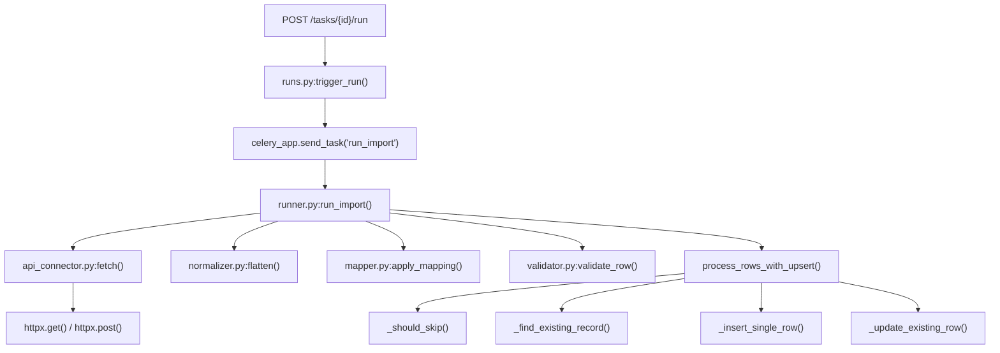

### Frontend Data Flow

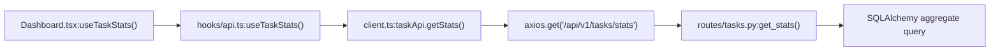

---

## Phase 6 — Audit: Quality, Security, Maintainability

### Error Handling Assessment

| Area | Status | Issues |
|------|--------|--------|
| API Routes | GOOD | Proper HTTPException usage |
| Service Layer | GOOD | Try-catch with logging |
| External API Calls | GOOD | Timeout handling, retry logic |
| Database Operations | GOOD | Transaction rollback on failure |
| Frontend | GOOD | Error boundaries, toast notifications |
| Silent Failures | CONCERN | Some errors logged but not surfaced |

**Specific Concerns:**
- `connection_service.py:60` - Decryption failure returns empty dict silently
- `runner.py` - Row errors logged but run can still show "completed"

### Auth & Authorization Boundaries

| Check | Status | Risk Level |
|-------|--------|------------|
| User Authentication | NOT IMPLEMENTED | HIGH |
| Role-Based Access | NOT IMPLEMENTED | HIGH |
| API Key Protection | N/A | - |
| Auth Credentials Storage | ENCRYPTED | LOW |
| Session Management | N/A | - |

**CRITICAL FINDING:** No authentication/authorization system. All endpoints are publicly accessible.

### Input Validation

| Layer | Validation Type | Status |
|-------|-----------------|--------|
| API Request Body | Pydantic models | GOOD |
| Query Parameters | Type hints | GOOD |
| Path Parameters | FastAPI validation | GOOD |
| External API Response | Basic JSON parsing | MODERATE |
| Database Input | SQLAlchemy types | GOOD |
| File Paths | Not applicable | - |

### Secrets Handling

| Secret Type | Storage | Risk |
|-------------|---------|------|
| Oracle Password | .env file | MODERATE (should be vault) |
| API Auth Tokens | Database (JSON) | LOW (in-transit only) |
| DB Connections | Encrypted file | LOW (Fernet encryption) |
| SECRET_KEY | .env file | MODERATE (should be vault) |

### Logging and Observability

| Aspect | Status | Implementation |
|--------|--------|----------------|
| Request Logging | PARTIAL | No request ID tracking |
| Error Logging | GOOD | Loguru with stack traces |
| Audit Trail | GOOD | task_logs, task_run_logs tables |
| Metrics | NOT IMPLEMENTED | No Prometheus/StatsD |
| Tracing | NOT IMPLEMENTED | No distributed tracing |

### Test Coverage Assessment

| Area | Unit Tests | Integration Tests | Coverage |
|------|------------|-------------------|----------|
| Services | 9 files | 4 files | ~70% |
| Routes | Via integration | 4 files | ~60% |
| Models | 1 file | Via integration | ~50% |
| Frontend | 12 files | - | ~40% |

### Prioritized Audit Report

#### Risk Matrix

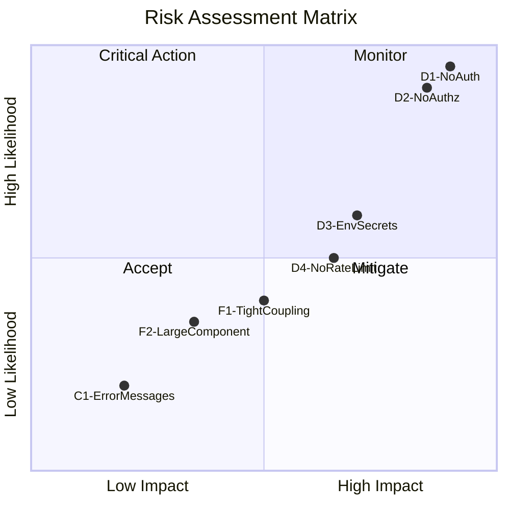

#### DANGEROUS (Data Loss, Security)

| ID | Issue | Location | Risk | Recommendation |
|----|-------|----------|------|----------------|
| D1 | No Authentication | All routes | CRITICAL | Implement JWT/OAuth |
| D2 | No Authorization | All routes | CRITICAL | Add RBAC middleware |
| D3 | Secrets in .env | .env file | HIGH | Use HashiCorp Vault |
| D4 | No Rate Limiting | API routes | HIGH | Add rate limiting middleware |

#### FRAGILE (Hard to Change)

| ID | Issue | Location | Impact | Recommendation |
|----|-------|----------|--------|----------------|
| F1 | Tight coupling runner.py | runner.py | HIGH | Extract strategies |
| F2 | Large TaskWizard component | TaskWizard.tsx | MEDIUM | Split into sub-components |
| F3 | No dependency injection | Services | MEDIUM | Add DI container |
| F4 | Hardcoded Oracle dialect | Multiple files | MEDIUM | Abstract DB layer |

#### COSMETIC (Low Priority)

| ID | Issue | Location | Impact | Recommendation |
|----|-------|----------|--------|----------------|
| C1 | Inconsistent error messages | Various | LOW | Standardize format |
| C2 | Missing docstrings | Some functions | LOW | Add documentation |
| C3 | Console.log statements | Frontend | LOW | Remove or use logger |
| C4 | Unused imports | Various files | LOW | Run linter cleanup |

### Security Recommendations Timeline

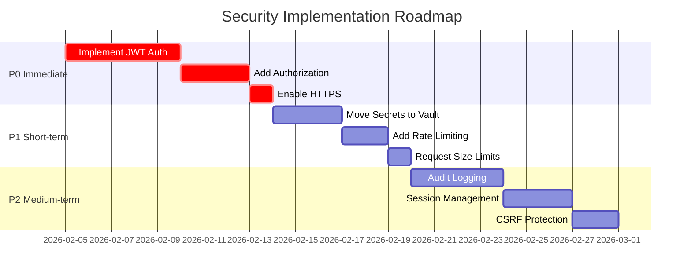

---

## Appendix A: File Path Quick Reference

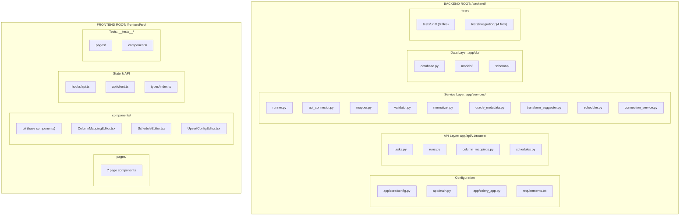

---

## Appendix B: Environment Variables Reference

```bash
# Required
ORACLE_USER=           # Oracle database username
ORACLE_PASSWORD=       # Oracle database password
ORACLE_HOST=           # Oracle host (IP or hostname)
ORACLE_PORT=1521       # Oracle port (default: 1521)
ORACLE_SERVICE_NAME=   # Oracle service name

# Required (Security)
SECRET_KEY=            # Encryption key (min 32 chars for production)

# Optional
APP_NAME=intake-gateway
APP_ENV=dev            # dev, staging, production
APP_LOG_LEVEL=INFO     # DEBUG, INFO, WARNING, ERROR
APP_TIMEZONE=UTC       # Timezone for scheduling

# Redis (required for Celery)
REDIS_URL=redis://localhost:6379/0
CELERY_BROKER_URL=${REDIS_URL}

# HTTP Client
HTTP_TIMEOUT_SECONDS=30
HTTP_MAX_RESPONSE_MB=10

# Alternative Oracle connection (instead of individual params)
ORACLE_DSN=            # Full Oracle DSN string
```

---

## Appendix C: Component Dependency Graph

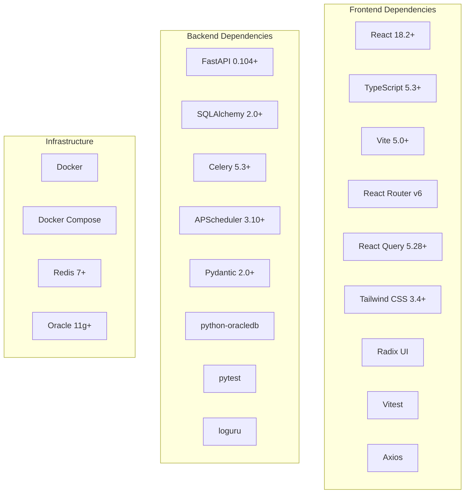

---

*Document generated by Claude Code - February 4, 2026*
*Mermaid diagrams compatible with GitHub, GitLab, Notion, and most markdown renderers*
